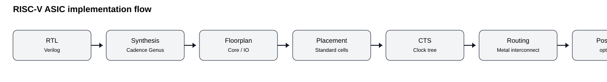

# RISC-V ASIC Physical Design

> **SCL Internship · Cadence Genus + Innovus · 180 nm ASIC implementation**

A public, interview-oriented engineering record of the ASIC implementation work performed on a **32-bit, five-stage RV32I RISC-V processor**, covering synthesis, floorplanning, placement, CTS, routing, post-route optimization, chip-level I/O integration, memory-integration work, and physical-design analysis.

The repository deliberately separates **evidence-backed results** from **reconstructed reference scripts**. It does not claim that an internal SCL TCL script has been reproduced verbatim when the original script was not supplied.

## Project at a glance

| Item | Evidence-backed detail |
|---|---|
| Architecture | 32-bit RV32I, 5-stage IF/ID/EX/MEM/WB |
| Synthesis | Cadence Genus 25.10-p002_1 |
| Physical implementation | Cadence Innovus 25.1/25.10-era evidence |
| Reported technology library | `tsl18fs120_scl_ss_1` |
| Reported Genus power | `1.86221e-03 W` |
| Innovus instances | `6525` |
| Innovus area | `226623.040` |
| Chip-level pads | `265` total / `234` signal / `15` VDD / `16` VSS |
| WNS/TNS | Not available in the supplied RISC-V result evidence |
| LVS | Not available |

## What this repository demonstrates

- RTL-to-gate synthesis methodology in Cadence Genus
- Technology mapping and optimization
- Physical implementation in Cadence Innovus
- Floorplanning and power-planning concepts
- Standard-cell placement
- Clock-tree synthesis
- Routing and post-route optimization
- Chip-level pad-ring integration
- Memory-integration considerations
- Area and power reporting
- Physical-verification flow and GDSII preparation
- Professional handling of incomplete/conflicting signoff evidence

## Architecture

The SCL report describes the processor as a 32-bit RV32I five-stage pipeline:

```text
IF → ID → EX → MEM → WB
```

The supplied RTL snapshot contains ALU/decoder logic, register file, control logic, branch handling, hazard detection, pipeline registers, CSR logic, data-memory interface and write-back logic.



Detailed architecture notes: [`docs/architecture/README.md`](docs/architecture/README.md)

## Implementation flow

### 1. RTL and functional verification

The supplied core RTL is retained under [`rtl/`](rtl/). The PDK-specific chip-level wrapper is intentionally omitted from the public repository because it directly instantiates technology-specific IO cells.

### 2. Cadence Genus synthesis

The internship report documents the following sequence:

```text
read_hdl
elaborate
define_clock
external_delay
check_design
syn_gen
syn_map
syn_opt
report_timing
report_power
write_hdl
write_sdc
```

The reported RISC-V synthesis used technology library `tsl18fs120_scl_ss_1` under `_nominal_ (balanced_tree)` conditions. The Genus power report gives a total of `1.86221e-03 W`.

See [`reports/synthesis/genus_report.md`](reports/synthesis/genus_report.md).

### 3. Floorplanning

The report describes establishing core dimensions and placement boundaries, followed by power planning. The chip-level implementation also involved I/O pads and memory integration.

### 4. Placement

The synthesized gate-level design was placed in Innovus, with optimization intended to balance timing, area and routing congestion.

### 5. Clock-tree synthesis

CTS was part of the documented backend flow. The public reference flow uses the standard Innovus `ccopt_design` stage.

### 6. Routing

Routing followed CTS. The documented methodology then uses post-route optimization where required.

### 7. Post-route optimization

The SCL report explicitly identifies `optDesign` as the post-route optimization utility.

### 8. Timing analysis

A technically honest repository should not invent timing results. The supplied RISC-V result section does not contain a clean numerical WNS/TNS/setup/hold result attributable to the final RISC-V implementation.

Therefore:

- **WNS:** not available
- **TNS:** not available
- **setup violations:** not available
- **hold violations:** not available
- **final clock period:** not available

See [`reports/timing/riscv_timing_status.md`](reports/timing/riscv_timing_status.md).

### 9. Physical verification

The report documents DRC as part of the Innovus flow. A clean RISC-V-specific DRC/LVS result is not present in the supplied result evidence, so none is claimed here.

See [`reports/physical_verification/drc_connectivity.md`](reports/physical_verification/drc_connectivity.md).

### 10. GDSII

The report states that the completed layouts were prepared for GDSII generation. No GDS database is included in this public repository.

## Results

### Area and power

| Metric | Value | Source |
|---|---:|---|
| Genus total power | `1.86221e-03 W` | SCL report, Ch. 7.5 |
| Innovus instance count | `6525` | Innovus `report_area` |
| Innovus total area | `226623.040` | Innovus `report_area` |

The detailed evidence is preserved in [`reports/`](reports/).

### Important report-integrity issue

The Innovus power block printed in the RISC-V section of the supplied report contains the same numerical values and UART-specific identifiers as the UART report, including `tx_inst_tx_reg` and a 339-instance total. It is therefore **not used as a validated RISC-V Innovus power metric**.

That discrepancy is documented rather than silently copied into the project's headline results.

## I/O pad-ring integration

The supplied chip-level pad definition contains **265 pads**:

| Pad class | Count |
|---|---:|
| Signal | 234 |
| VDD | 15 |
| VSS | 16 |
| **Total** | **265** |

### Clockwise distribution

| Side | Signal | VDD | VSS | Total |
|---|---:|---:|---:|---:|
| Bottom | 34 | 3 | 3 | 40 |
| Right | 65 | 4 | 4 | 73 |
| Top | 70 | 4 | 5 | 79 |
| Left | 65 | 4 | 4 | 73 |
| **Total** | **234** | **15** | **16** | **265** |

The raw `.io` file is intentionally omitted; the evidence-derived pad record is in [`docs/io_pad_ring.md`](docs/io_pad_ring.md).

## Memory macro integration

The SCL report states that the final RISC-V implementation incorporated memory macros and I/O pads. The supplied implementation notes also document a synthesis issue around the behavioral `data_memory` array and the production need for a technology memory macro.

The published Innovus area excerpt contains `k11 data_memory` with an instance count of `0`. Because that conflicts with the narrative claim of final memory integration, this repository does **not** invent a final macro count. See [`docs/memory_macro_integration.md`](docs/memory_macro_integration.md).

## Screenshots

The following sanitized screenshots show the physical implementation evidence supplied with the project.

### Routed RISC-V implementation


### Core/chip physical-design view


### I/O / memory integration views

| IO / memory view | IO / memory view |
|---|---|
|  |  |
|  |  |

## Physical-design debug playbook

For interview preparation, [`docs/notes/physical_design_debug_playbook.md`](docs/notes/physical_design_debug_playbook.md) reconstructs the practical placement → CTS → route → post-route → DRC/debug loop. It is explicitly labeled reconstructed rather than presented as an original command transcript.

## Reference scripts

The scripts under [`scripts/`](scripts/) are **reconstructed reference flows**, based on the documented SCL methodology and standard Cadence flow structure. They are useful for demonstrating the execution model in an interview, but they are not represented as the exact proprietary SCL scripts.

- [`scripts/genus/riscv_synthesis_reference.tcl`](scripts/genus/riscv_synthesis_reference.tcl)
- [`scripts/innovus/01_init_floorplan_reference.tcl`](scripts/innovus/01_init_floorplan_reference.tcl)
- [`scripts/innovus/02_place_cts_route_reference.tcl`](scripts/innovus/02_place_cts_route_reference.tcl)
- [`scripts/innovus/03_signoff_reference.tcl`](scripts/innovus/03_signoff_reference.tcl)

## Reproduction

A full rerun requires the original SCL technology environment: standard-cell timing/physical libraries, IO library, memory macro collateral, authorized Cadence installation, and the original implementation database/configuration. Those are not included here.

The conceptual rerun is:

```text
RTL
 ↓
Genus: elaborate → synthesize → report → export netlist/SDC
 ↓
Innovus: init → floorplan → power plan → placement
 ↓
CTS → route → post-route optimization
 ↓
timing / area / power / DRC / connectivity
 ↓
GDSII stream-out
```

## Repository structure

```text
riscv-asic-physical-design/
├── README.md
├── rtl/
├── docs/
│   ├── architecture/
│   ├── io_pad_ring.md
│   ├── memory_macro_integration.md
│   ├── publication_audit.md
│   └── rtl-to-gdsii.svg
├── scripts/
│   ├── genus/
│   └── innovus/
├── reports/
│   ├── synthesis/
│   ├── timing/
│   ├── area/
│   ├── power/
│   └── physical_verification/
├── images/
└── results/
```

## Publication / confidentiality

The public repository excludes PDKs, standard-cell libraries, IO LEFs, memory macro databases, raw SCL `.io` files, Cadence databases, GDS/DEF outputs, internal absolute paths and hostnames.

See [`docs/publication_audit.md`](docs/publication_audit.md).

